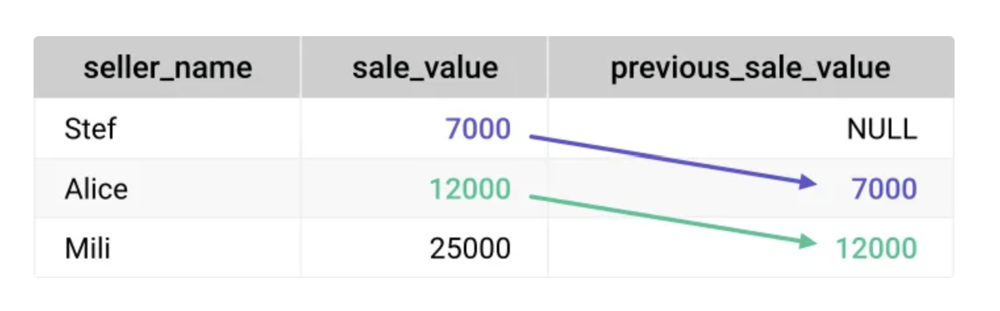
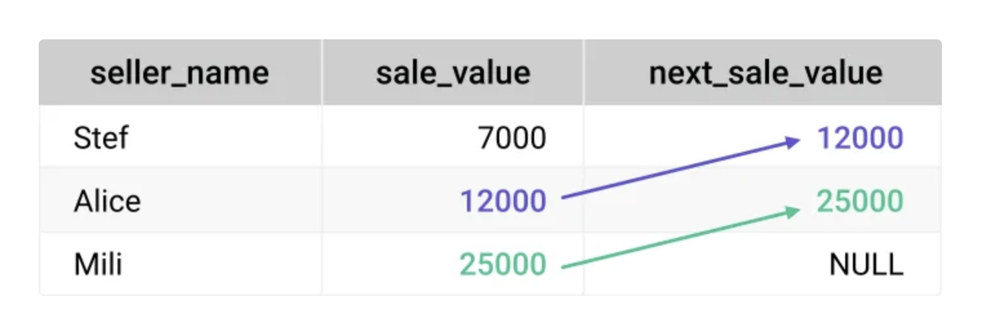
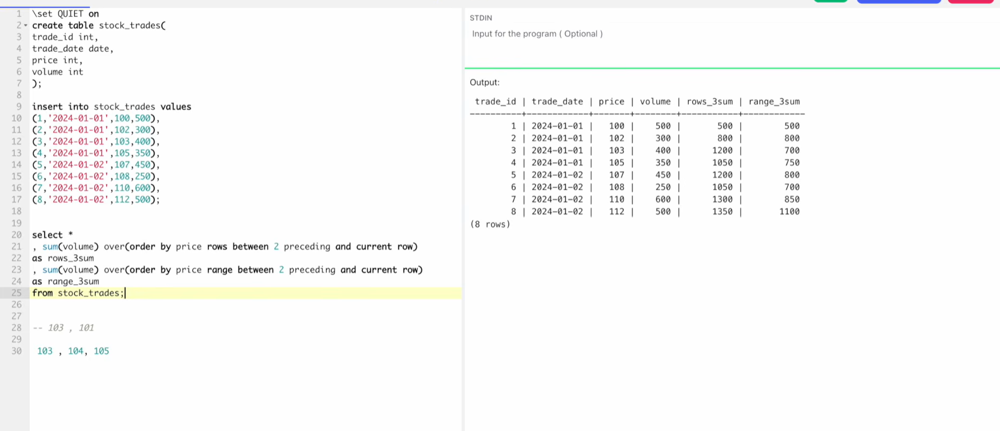
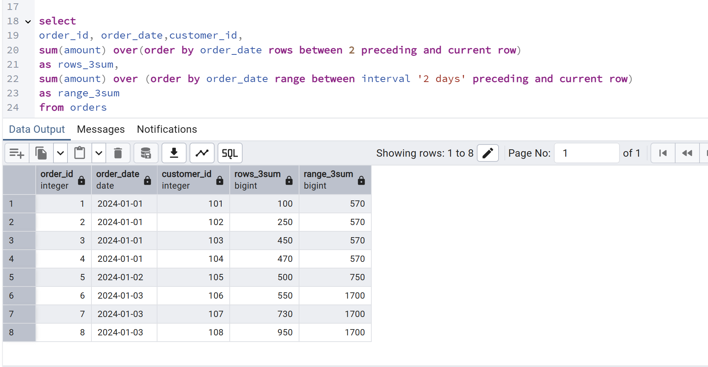
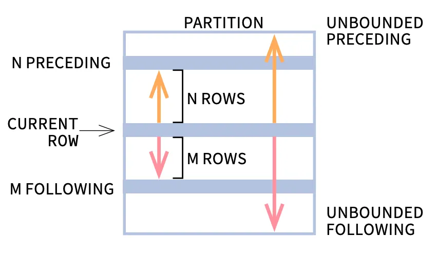

### NOT IN VS NOT EXISTS
- NOT IN can return unexpected results when NULLs exist
- NOT EXISTS handles NULLs safely
- One hidden NULL can change your entire output
- This is a common interview + production-level SQL mistake

## UNION VS UNION ALL
- UNION ALL is often the better choice.

𝐖𝐡𝐲?
- UNION removes duplicates
- Performs duplicate elimination internally
- Can be slower on large datasets

𝐖𝐡𝐞𝐫𝐞𝐚𝐬:
- UNION ALL keeps all rows
- Avoids unnecessary deduplication
- Usually faster for analytics workloads

## count(*) VS Count(ColumnName)

- count(*) -> Count All rows
- count(column) -> ignore NULL Values

## LAG() Function 

The LAG() function allows access to a value stored in a different row above the current row. The row above may be adjacent or some number of rows above, as sorted by a specified column or set of columns.

Let’s look its syntax:

- LAG(expression [,offset[,default_value]]) OVER(ORDER BY columns)

LAG() takes three arguments: the name of the column or an expression from which the value is obtained, the number of rows to skip (offset) above, and the default value to be returned if the stored value obtained from the row above is empty. Only the first argument is required. The third argument (default value) is allowed only if you specify the second argument, the offset.

```
SELECT seller_name, sale_value,
  LAG(sale_value) OVER(ORDER BY sale_value) as previous_sale_value
FROM sale;
```



## LEAD() FUnction

- LEAD(expression [,offset[,default_value]]) OVER(ORDER BY columns)

LEAD() function takes three arguments: the name of a column or an expression, the offset to be skipped below, and the default value to be returned if the stored value obtained from the row below is empty. Only the first argument is required. The third argument, the default value, can be specified only if you specify the second argument, the offset.

```
SELECT seller_name, sale_value,
  LEAD(sale_value) OVER(ORDER BY sale_value) as next_sale_value
FROM sale;
```



# 📓 SQL Window Functions: `ROWS BETWEEN` vs. `RANGE BETWEEN`

---

## 📌 Core Difference
> **Golden Rule:**  
> - `ROWS BETWEEN` → works on **physical row positions**.  
> - `RANGE BETWEEN` → works on **logical values** in the `ORDER BY` column.

---

## 🔢 Example with Integers (`price` in `stock_trades`)

### `ROWS BETWEEN`
```sql
SELECT 
    trade_id, trade_date, price, volume,
    SUM(volume) OVER (
        ORDER BY price 
        ROWS BETWEEN 2 PRECEDING AND CURRENT ROW
    ) AS rows_3_sum
FROM stock_trades;

```
- Looks at **exactly 2 rows before + current row**.  
- Ignores gaps in `price`.

### `RANGE BETWEEN`
```sql
SELECT 
    trade_id, trade_date, price, volume,
    SUM(volume) OVER (
        ORDER BY price 
        RANGE BETWEEN 2 PRECEDING AND CURRENT ROW
    ) AS range_3_sum
FROM stock_trades;
```
- If current `price = 103`, sums all rows with `price` in `[101, 103]`.  
- Includes **all rows** in that logical range.

---

## 📅 Example with Dates (`order_date` in `orders`)

### `ROWS BETWEEN`
```sql
SELECT 
    order_id, order_date, customer_id, amount,
    SUM(amount) OVER (
        ORDER BY order_date 
        ROWS BETWEEN 2 PRECEDING AND CURRENT ROW
    ) AS rows_3_sum
FROM orders;
```
- Sums **current + 2 preceding rows**, regardless of actual dates.

### `RANGE BETWEEN` (with `INTERVAL`)
```sql
SELECT 
    order_id, order_date, customer_id, amount,
    SUM(amount) OVER (
        ORDER BY order_date 
        RANGE BETWEEN INTERVAL '2 days' PRECEDING AND CURRENT ROW
    ) AS range_3_sum
FROM orders;
```
- If current row = `Jan 3`, sums all rows between `Jan 1` → `Jan 3`.  
- Includes **all orders** in that date window.

---

## ✅ Summary Checklist

| Feature            | `ROWS BETWEEN`                        | `RANGE BETWEEN`                                |
|--------------------|----------------------------------------|------------------------------------------------|
| **Logic Basis**    | Physical row positions                 | Logical values in `ORDER BY` column            |
| **Row Limit**      | Fixed offset (e.g., 2 rows)            | Dynamic, includes all rows in value range      |
| **Dates vs. Ints** | Works same for both                    | Requires `INTERVAL` for dates                  |
| **Best Use Case**  | Strict moving averages (last N rows)   | Value/time-bound windows (e.g., last 48 hours) |

---

💡 **Tip:**  
- Use `ROWS BETWEEN` when you want **exact row counts** (e.g., last 5 trades).  
- Use `RANGE BETWEEN` when you want **value-based ranges** (e.g., all trades in last 2 days or within ±10 price units).








# 📘 Advanced SQL Window Functions FIRST_VALUE, LAST_VALUE,NTH_VALUE, NTILE, CUME_DIST,PERCENT_RANK and Frame Clause Tutorial

`FIRST_VALUE`, `LAST_VALUE`, `NTH_VALUE`, `NTILE`, `CUME_DIST`, and `PERCENT_RANK`,  
as well as an in-depth look at **Frame Clauses** and the alternate `WINDOW` syntax.  

---

## 1️⃣ The Dataset
All examples in this tutorial use a `product` table containing product categories, brands, product names, and prices.  

```sql
CREATE TABLE product (
    product_category varchar(255),
    brand varchar(255),
    product_name varchar(255),
    price int
);
```

*Sample categories include Phone, Laptop, Earphone, Headphone, and Smartwatch.*

---

## 2️⃣ FIRST_VALUE
**Concept:** Extracts a value or column from the very first record within a defined partition.  

**Example:** Fetch the most expensive product under each category.  

```sql
SELECT *,
    first_value(product_name) OVER(PARTITION BY product_category ORDER BY price DESC) AS most_exp_product
FROM product;
```
**SYNTAX**
```sql
FIRST_VALUE(expression) OVER (
    [PARTITION BY partition_expression, ...]
    ORDER BY sort_expression [ASC | DESC]
    [rows_range_clause]
)
```

**Explanation:**  
- `PARTITION BY product_category` → divides data into windows per category.  
- `ORDER BY price DESC` → sorts by descending price.  
- `first_value(product_name)` → grabs product name from the first row.  

---

## 3️⃣ LAST_VALUE & The Frame Clause
**Concept:** Fetches a value from the very last record of a partition.  

⚠️ **Issue:** Default frame clause (`RANGE BETWEEN UNBOUNDED PRECEDING AND CURRENT ROW`) restricts access up to the current row, causing incorrect results.  

**Solution:** Explicitly extend frame to include all rows with `UNBOUNDED FOLLOWING`.  

**SYNTAX**

```sql
LAST_VALUE(expression) OVER (
    [PARTITION BY partition_expression, ...]
    ORDER BY sort_expression [ASC | DESC]
    [rows_range_clause]
)
```
```sql
SELECT *,
    first_value(product_name) OVER(PARTITION BY product_category ORDER BY price DESC) AS most_exp_product,
    last_value(product_name) OVER(PARTITION BY product_category ORDER BY price DESC
        RANGE BETWEEN unbounded preceding AND unbounded following) AS least_exp_product
FROM product
WHERE product_category ='Phone';
```

### RANGE vs. ROWS
| Feature | `ROWS` | `RANGE` |
|---------|--------|---------|
| Basis   | Physical row positions | Logical values in `ORDER BY` |
| Handling | Stops at exact row | Extends to duplicates with same value |

---

## 4️⃣ Alternate Window Syntax
**Concept:** Use `WINDOW` keyword to avoid repeating identical `OVER` clauses.  

```sql
SELECT *,
    first_value(product_name) OVER w AS most_exp_product,
    last_value(product_name) OVER w AS least_exp_product
FROM product
WHERE product_category ='Phone'
WINDOW w AS (PARTITION BY product_category ORDER BY price DESC
    RANGE BETWEEN unbounded preceding AND unbounded following);
```

---

## 5️⃣ NTH_VALUE
**Concept:** Fetches a value from a specific position (Nth row) within a partition.  

**Example:** Display the 5th most expensive product under each category.  

**SYNTAX**

```sql
NTH_VALUE(expression, nth_row) OVER (
    [PARTITION BY partition_expression, ...]
    ORDER BY sort_expression [ASC | DESC]
    [rows_range_clause]
)
```
```sql
SELECT *,
    first_value(product_name) OVER w AS most_exp_product,
    last_value(product_name) OVER w AS least_exp_product,
    nth_value(product_name, 5) OVER w AS second_most_exp_product
FROM product
WINDOW w AS (PARTITION BY product_category ORDER BY price DESC
    RANGE BETWEEN unbounded preceding AND unbounded following);
```

⚠️ If partition has fewer rows than N, returns `NULL`.  
Frame clause must include `UNBOUNDED FOLLOWING`.  

---

## 6️⃣ NTILE
**Concept:** Divides sorted dataset into specified number of buckets.  

**Example:** Segregate phones into 3 categories.  

**SYNTAX**
```sql
NTILE(number_of_buckets) OVER (
    [PARTITION BY partition_expression, ...]
    ORDER BY sort_expression [ASC | DESC]
)
```

```sql
SELECT x.product_name,
    CASE 
        WHEN x.buckets = 1 THEN 'Expensive Phones'
        WHEN x.buckets = 2 THEN 'Mid Range Phones'
        WHEN x.buckets = 3 THEN 'Cheaper Phones' 
    END AS Phone_Category
FROM (
    SELECT *,
        ntile(3) OVER (ORDER BY price DESC) AS buckets
    FROM product
    WHERE product_category = 'Phone'
) x;
```

---

## 7️⃣ CUME_DIST (Cumulative Distribution)
**Concept:** Returns percentage of rows with values ≤ current row.  

**Formula:**  
\[
\text{CUME\_DIST} = \frac{\text{Row No (last duplicate)}}{\text{Total Rows}}
\]

**SYNTAX**
```sql
CUME_DIST() OVER (
    [PARTITION BY partition_expression, ...]
    ORDER BY sort_expression [ASC | DESC]
)
```

**Example:** Fetch products in top 30% most expensive.  

```sql
SELECT product_name, cume_dist_percetage
FROM (
    SELECT *,
        cume_dist() OVER (ORDER BY price DESC) AS cume_distribution,
        ROUND(cume_dist() OVER (ORDER BY price DESC)::numeric * 100, 2) || '%' AS cume_dist_percetage
    FROM product
) x
WHERE x.cume_distribution <= 0.3;
```

---

## 8️⃣ PERCENT_RANK
**Concept:** Relative rank of each row as a percentage.  

**Formula:**  
\[
\text{PERCENT\_RANK} = \frac{\text{Row No} - 1}{\text{Total Rows} - 1}
\]

**SYNTAX**

```sql
PERCENT_RANK() OVER (
    [PARTITION BY partition_expression, ...]
    ORDER BY sort_expression [ASC | DESC]
)
```

**Example:** Compare "Galaxy Z Fold 3" with all products.  

```sql
SELECT product_name, per
FROM (
    SELECT *,
        percent_rank() OVER(ORDER BY price) ,
        ROUND(percent_rank() OVER(ORDER BY price)::numeric * 100, 2) AS per
    FROM product
) x
WHERE x.product_name='Galaxy Z Fold 3';
```

---

✅ **Summary:**  
- `FIRST_VALUE` → first record in partition.  
- `LAST_VALUE` → last record (requires frame clause).  
- `NTH_VALUE` → Nth record.  
- `NTILE` → bucket distribution.  
- `CUME_DIST` → cumulative percentage.  
- `PERCENT_RANK` → relative rank percentage.  
- Frame clauses (`ROWS` vs `RANGE`) are critical for correct results.  
- Use `WINDOW` keyword for cleaner queries. 


# 📘 Recursive Queries in SQL (`WITH RECURSIVE`)

## 🔹 What is `WITH RECURSIVE`?
- `WITH RECURSIVE` allows you to define **Common Table Expressions (CTEs)** that reference themselves.
- Useful for problems involving **hierarchies, graphs, or sequences**.
- Typical use cases:
  - Organizational charts (employees → managers).
  - Tree structures (categories → subcategories).
  - Graph traversal (paths, connectivity).
  - Generating sequences (numbers, dates).

---

## 🔹 Structure of a Recursive CTE
A recursive CTE has **two parts**:
1. **Anchor Member** → Base query (non-recursive).
2. **Recursive Member** → Refers back to the CTE itself.

```sql
WITH RECURSIVE cte_name AS (
    -- Anchor member
    SELECT initial_values
    UNION ALL
    -- Recursive member
    SELECT next_values
    FROM cte_name
    JOIN other_tables
    WHERE termination_condition
)
SELECT * FROM cte_name;
---
## 🔹 Example 1: Generate Numbers 1 to 10
```sql
WITH RECURSIVE numbers AS (
    SELECT 1 AS n              -- Anchor
    UNION ALL
    SELECT n + 1               -- Recursive
    FROM numbers
    WHERE n < 10               -- Termination
)
SELECT * FROM numbers;
```
✅ Output: 1, 2, 3, …, 10

---

## 🔹 Example 2: Employee Hierarchy
```sql
WITH RECURSIVE emp_cte AS (
    -- Anchor: start with the manager
    SELECT emp_id, emp_name, manager_id, 1 AS level
    FROM employees
    WHERE manager_id IS NULL

    UNION ALL

    -- Recursive: find subordinates
    SELECT e.emp_id, e.emp_name, e.manager_id, c.level + 1
    FROM employees e
    INNER JOIN emp_cte c ON e.manager_id = c.emp_id
)
SELECT * FROM emp_cte ORDER BY level;
```
✅ Output: Hierarchical list of employees with levels.

---

## 🔹 Example 3: Factorial Calculation
```sql
WITH RECURSIVE factorial(n, fact) AS (
    SELECT 1, 1                -- Anchor: 1! = 1
    UNION ALL
    SELECT n + 1, fact * (n + 1)
    FROM factorial
    WHERE n < 5
)
SELECT * FROM factorial;
```
✅ Output: factorial values from 1! to 5!

---

## 🔹 Key Notes
- Always include a **termination condition** (`WHERE n < ...`) to avoid infinite loops.
- `UNION ALL` is typically used (instead of `UNION`) for performance.
- Recursive CTEs are supported in **PostgreSQL, SQL Server, Oracle (with CONNECT BY), and MySQL 8+**.

---

## 🔹 Practical Applications
- 📂 File system traversal (folders → subfolders).
- 🏢 Corporate hierarchy.
- 📊 Graph algorithms (shortest path, connectivity).
- 📅 Date range generation.

## Example

```sql
WITH RECURSIVE range_cte AS (
    SELECT MIN(num) AS min_num, MAX(num) AS max_num
    FROM numbers
),
num_cte AS (
    -- anchor: start at min_num
    SELECT min_num AS num, max_num
    FROM range_cte
    UNION ALL
    -- recursive step: keep adding +1 until max_num
    SELECT num + 1, max_num
    FROM num_cte
    WHERE num < max_num
)
SELECT num
FROM num_cte
WHERE num NOT IN (SELECT num FROM numbers)
ORDER BY num;
```

## 🧩 Query Breakdown

### 1. `range_cte`
```sql
WITH RECURSIVE range_cte AS (
    SELECT MIN(num) AS min_num, MAX(num) AS max_num
    FROM numbers
)
```
- This is **not recursive**.  
- It simply finds the **minimum and maximum values** from the `numbers` table.  
- Example: If `numbers` contains `2, 5, 7`, then `min_num = 2`, `max_num = 7`.

---

### 2. `num_cte`
```sql
num_cte AS (
    -- anchor: start at min_num
    SELECT min_num AS num, max_num
    FROM range_cte

    UNION ALL

    -- recursive step: keep adding +1 until max_num
    SELECT num + 1, max_num
    FROM num_cte
    WHERE num < max_num
)
```

- **Anchor member:** Starts at the minimum number (`min_num`).  
- **Recursive member:** Adds `+1` each time until it reaches `max_num`.  
- The **termination condition is inside the recursive step**:
  ```sql
  WHERE num < max_num
  ```
  This ensures recursion stops once `num = max_num`.

So even though you didn’t write a separate termination clause outside, the recursion is naturally bounded by `num < max_num`.

---

### 3. Final Selection
```sql
SELECT num
FROM num_cte
WHERE num NOT IN (SELECT num FROM numbers)
ORDER BY num;
```

- This generates the **full range** from `min_num` to `max_num`.  
- Then it filters out numbers that already exist in the `numbers` table.  
- Result: You get the **missing numbers** in the sequence.

---

## 🔹 Example Walkthrough

Suppose `numbers` table has:
```
2
4
6
```

- `range_cte` → `min_num = 2`, `max_num = 6`
- `num_cte` generates: `2, 3, 4, 5, 6`
- Final filter removes existing (`2, 4, 6`) → Output: `3, 5`

---

## ✅ Key Insight
- The **termination condition is implicit** in the recursive member (`WHERE num < max_num`).  
- Without it, recursion would be infinite.  
- That’s why your query is safe: it **stops at the maximum number**.


# 🔢 Using `generate_series` and  `EXCEPT` in SQL

## 🔹 What is `generate_series`?
- `generate_series(start, stop [, step])` is a PostgreSQL function that generates a set of values.
- Commonly used to create ranges of numbers or dates.
- Example:
  ```sql
  SELECT generate_series(1, 5);

  ```
  ✅ Output: 1, 2, 3, 4, 5

---

## 🔹 What is `EXCEPT`?
- `EXCEPT` returns rows from the **first query** that are **not present in the second query**.
- It’s essentially a **set difference** operator.
- Example:
  ```sql
  SELECT 1
  EXCEPT
  SELECT 1;
  ```
  ✅ Output: (no rows, because 1 exists in both)

---

## 🔹 Finding Missing Numbers
Suppose you have a table:

```sql
CREATE TABLE numbers (num INT);
INSERT INTO numbers VALUES (1), (2), (4), (6);
```

You want to find missing numbers between the **minimum and maximum**.

### Query:
```sql
WITH range AS (
    SELECT MIN(num) AS min_num, MAX(num) AS max_num
    FROM numbers
)
SELECT generate_series(min_num, max_num) AS num
FROM range
EXCEPT
SELECT num FROM numbers
ORDER BY num;
```

### Step-by-step:
1. `range` → finds min and max (here: 1 and 6).
2. `generate_series(min_num, max_num)` → generates 1, 2, 3, 4, 5, 6.
3. `EXCEPT` removes numbers that already exist in the table.
4. Final result → missing numbers.

---

## 🔹 Example Output
For table values `1, 2, 4, 6`:

- Generated series: `1, 2, 3, 4, 5, 6`
- Existing numbers: `1, 2, 4, 6`
- Missing numbers: `3, 5`

✅ Output:
```
3
5
```

---

## 🔹 Key Notes
- `generate_series` is **compact and efficient** compared to recursive CTEs.
- `EXCEPT` is a clean way to subtract existing values.
- Works well for **continuous ranges** (numbers, dates).
- For very large ranges, performance may depend on indexing and query optimization.

---

## 🔹 Practical Applications
- Detect missing IDs in sequences.
- Find missing dates in a timeline.
- Validate data completeness in ETL pipelines.