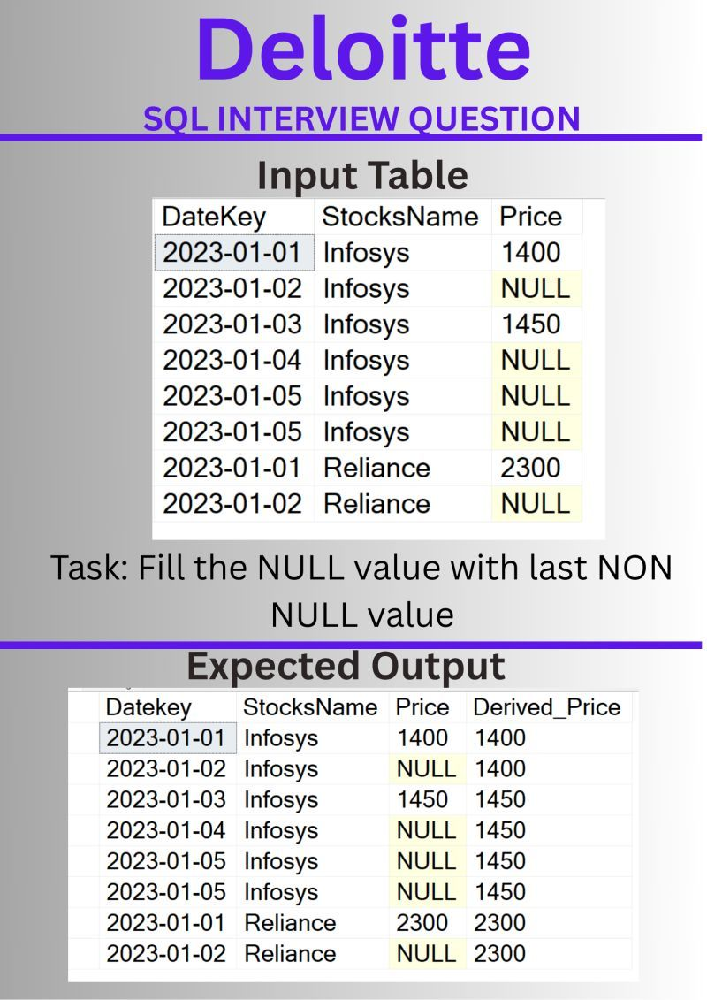

### Day 1 
- Return only the unique combinations of Source and Destination cities.
- Company : Deloitte
- Level: Easy
- Link: https://github.com/meraviverma/sql/blob/master/2026_SqlChallenge/Day1_Deloitte_FIndUniqueCombination.sql

---

### Day 2
- Calculate the percentage of each gender in the company.
- Company : PWC
- Level: Easy
- Link: https://github.com/meraviverma/sql/blob/master/2026_SqlChallenge/Day2_PrecentageOfEachGender.sql

### Day3
- Fill every NULL price using the most recent non-NULL value.
- Company : Deloitee
- Level : Medium
- Concept: MAX, SUM, PARTITION BY , ORDER BY , ROWS BETWEEN UNBOUNDED PRECEDING AND CURRENT ROW
- Link: https://github.com/meraviverma/sql/blob/master/2026_SqlChallenge/Day3_Deloitte_FillNull_Recent_NonNull.sql
- 

### Day 4
- Concept Time: Rows Between Range Between